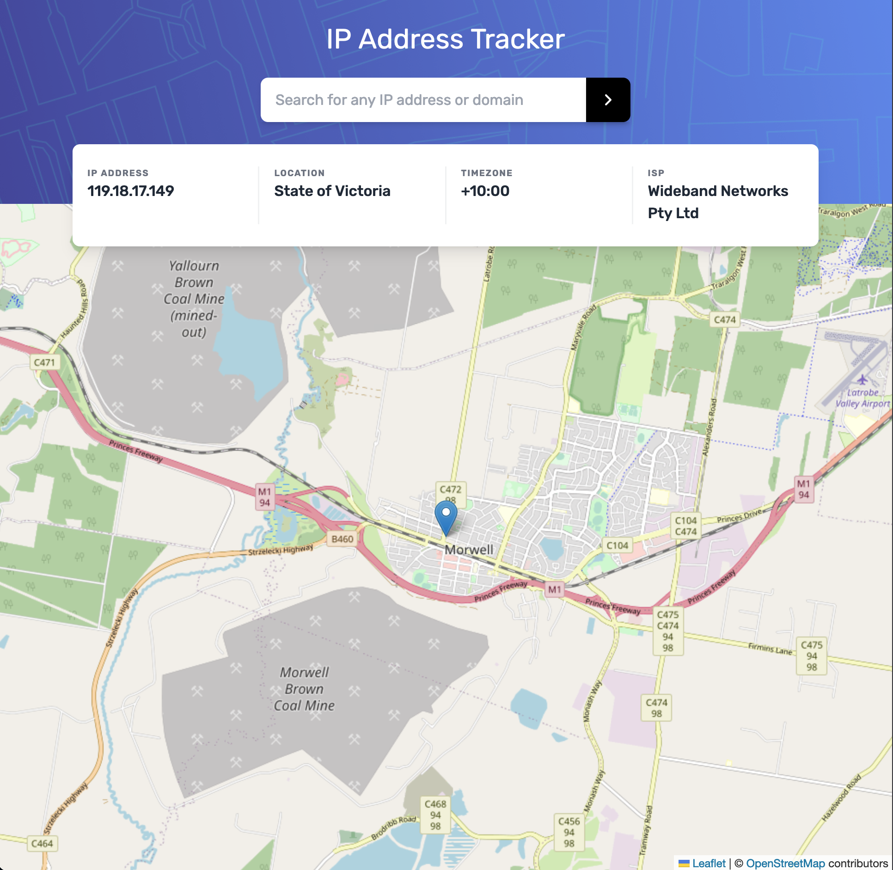
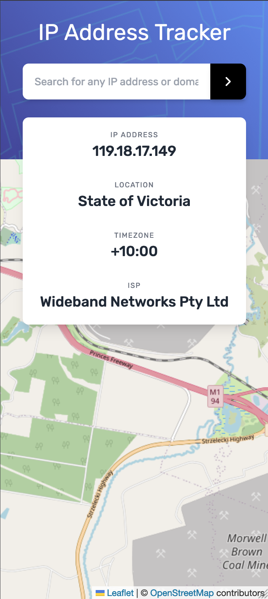

# Frontend Mentor - IP address tracker solution

This is a solution to the [IP address tracker challenge on Frontend Mentor](https://www.frontendmentor.io/challenges/ip-address-tracker-I8-0yYAH0). Frontend Mentor challenges help you improve your coding skills by building realistic projects. 

## Table of contents

- [Overview](#overview)
  - [The challenge](#the-challenge)
  - [Screenshot](#screenshot)
  - [Links](#links)
- [My process](#my-process)
  - [Built with](#built-with)
  - [What I learned](#what-i-learned)
  - [Useful resources](#useful-resources)
- [Author](#author)

## Overview

### The challenge

Users should be able to:

- View the optimal layout for each page depending on their device's screen size
- See hover states for all interactive elements on the page
- See their own IP address on the map on the initial page load
- Search for any IP addresses or domains and see the key information and location

### Screenshot

### Links

- Solution URL: [Add solution URL here](https://your-solution-url.com)
- Live Site URL: [Add live site URL here](https://your-live-site-url.com)

## My process

### Built with

- Semantic HTML5 markup
- CSS custom properties
- Flexbox
- CSS Grid
- Mobile-first workflow
- [React](https://reactjs.org/) - JS library
- [Remix](https://remix.run/) - React framework
- [TailwindCSS](https://tailwindcss.com/) - For styles
- [IP Geolocation API by IPify](https://geo.ipify.org/) - For IP Geolocation
- [Leaflet](https://leafletjs.com/) - For map

### What I learned

I used several new technologies in this project to get some experience with them. I've had a lot of fun learning Remix and its differences from NextJS. 

My main takeaway from this project was learning how to stich data together from multiple API sources. I used the IP Geolocation API by IPify to get the IP address and location data. I then used the Leaflet library to display the map. I had to use the IP Geolocation API to get the latitude and longitude of the IP address and then pass that to Leaflet to display the map.

This was also the first time using Bun 1.0 and loving it so far. Defnitely faster than npm and yarn.

### Useful resources

- [CodeSandbox - remix-run/examples:leaflet](https://codesandbox.io/p/sandbox/github/remix-run/examples/tree/main/leaflet) - This really helped me out in understanding how to use Leaflet with Remix which is a SSR framework only. I really liked this pattern and will use it going forward.

## Author

- Frontend Mentor - [@danmeldominique](https://www.frontendmentor.io/profile/danmeldominique)
- Twitter - [danmeldominique](https://github.com/danmeldominique)
